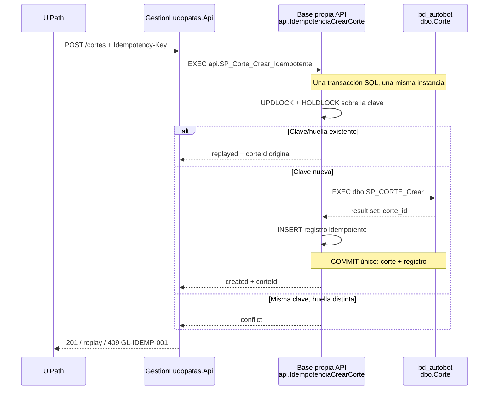

# Pase DBA y fundamento arquitectónico — idempotencia persistente de `crearCorte`

> **Cómo usar este documento:** leerlo de principio a fin antes de ejecutar
> `001_instalar_idempotencia_corte.sql`. Es un pase técnico autocontenido: explica qué
> se debe hacer, quién lo hace, qué prueba cada paso, por qué existe y qué riesgo deja
> abierto si se omite. El script es el mecanismo; este documento es la justificación y
> el criterio de aceptación.

## 1. Decisión solicitada

Autorizar una base SQL Server propia de `GestionLudopatas.Api`, en la **misma instancia**
que `bd_autobot`, para alojar un único registro idempotente y el procedimiento
`api.SP_Corte_Crear_Idempotente`. La API recibirá `EXECUTE` sobre ese procedimiento, no
permisos directos de tabla.

No se solicita modificar `bd_autobot`, `dbo.Corte` ni `dbo.SP_CORTE_Crear`; tampoco se
solicita credenciales nuevas, datos de negocio ni acceso de la API a tablas existentes.

## 2. Problema que resuelve

`POST /api/v1/cortes` crea un corte. La red, UiPath y HTTP pueden reintentar una misma
solicitud por timeout, corte de conexión o respuesta no recibida. Si el mismo intento
ejecuta dos veces `SP_CORTE_Crear`, se crean dos filas y dos cortes operativos.

La API actual recibe `Idempotency-Key` y guarda el resultado en memoria durante 24 horas.
Eso evita duplicados simultáneos **solo dentro de un proceso**. No basta para producción
porque:

1. Un reinicio borra la memoria: el reintento vuelve a ejecutar el SP.
2. Dos réplicas tienen memorias distintas: ambas pueden ejecutar el SP.
3. Existe una ventana crítica: el SP pudo confirmar el corte y el proceso caer antes de
   guardar la respuesta en memoria. El reintento ya no puede distinguir «no se creó» de
   «se creó pero no alcancé a responder».

El objetivo no es hacer HTTP transaccional. El objetivo es que el corte y la evidencia
de su creación compartan el **mismo commit SQL**, de modo que un reintento tenga siempre
una respuesta determinista.



## 3. Evidencia revisada en DEV

| Hecho comprobado | Evidencia | Por qué importa |
|---|---|---|
| Motor | SQL Server 2022 (`16.0.1000.6`) | Soporta los objetos y sintaxis usados por el script. |
| Alta disponibilidad | Always On deshabilitado; `replica_id=NULL` | Reduce una restricción conocida para la transacción entre bases; DBA aún certifica la topología final. |
| `dbo.SP_CORTE_Crear` | Un `INSERT` sin `BEGIN/COMMIT/ROLLBACK` propios | Puede participar en la transacción exterior del wrapper. |
| Resultado del SP | `OUTPUT INSERTED.id AS corte_id` | El wrapper debe capturarlo con `INSERT ... EXEC`; no existe parámetro de salida. |
| `dbo.Corte` | PK solo en `id`; no hay clave natural | La misma petición no puede identificarse de forma segura consultando los datos actuales. |
| Tabla de negocio | Sin triggers; no memory-optimized; defaults locales | No hay efectos secundarios conocidos ni restricción de tabla en memoria para el flujo. |
| Login de API | `EXECUTE` sí; sin `CREATE TABLE`, `VIEW DEFINITION`, roles reader/writer/owner | Confirma D5: el instalador debe ser DBA y la API no debe hacer DDL/DML directo. |

La evidencia se obtuvo con consultas de metadata y no expone contraseñas ni filas de
negocio.

## 4. Alternativas evaluadas y por qué se descartan

### A. Mantener solo memoria local

**Ventaja:** no requiere DDL ni coordinación DBA.

**Por qué no basta:** el proceso puede reiniciar y las instancias no comparten memoria.
No resuelve la caída entre el commit del SP y el registro de respuesta. Se mantiene
únicamente como protección actual de una sola instancia hasta activar la solución final.

### B. Crear una tabla persistente y consultar antes de llamar al SP

**Ventaja:** parece más simple que un wrapper SQL.

**Por qué se rechaza:** tiene la carrera `consultar → SP → guardar`. Dos solicitudes
pueden no encontrar registro y ambas crear un corte. Si el SP confirma y la API cae antes
del `INSERT` de idempotencia, reaparece el mismo hueco. Una tabla sin transacción común
no aporta la propiedad que se busca.

### C. Dar `INSERT`/`SELECT` directo a la API sobre `bd_autobot`

**Ventaja:** menos objetos nuevos.

**Por qué se rechaza:** rompe D5 y amplía el radio de daño de una API comprometida. El
login hoy solo puede ejecutar los procedimientos aprobados; convertirlo en dueño de
tablas de negocio contradice mínimo privilegio y mezcla datos de integración con datos
del proceso de cortes.

### D. Modificar `dbo.SP_CORTE_Crear`

**Ventaja:** la idempotencia quedaría dentro de `bd_autobot`.

**Por qué no es la primera opción:** cambia un SP de negocio existente y aumenta el
riesgo sobre otros consumidores. La alternativa elegida lo envuelve sin alterarlo. Si
DBA determina que las bases no pueden compartir una transacción, esta pasa a ser la
alternativa a rediseñar y aprobar explícitamente.

### E. Base propia + wrapper transaccional — elegida

**Beneficio:** la clave, el corte y el resultado se confirman o revierten juntos; las
instancias comparten un único registro duradero y D5 se conserva.

**Costo:** una base/esquema nuevo, un procedimiento, operación de purga y una prueba
DBA antes de cambiar la API.

**Condición:** ambas bases deben residir en la misma instancia SQL y el wrapper debe ser
validado en DEV antes de pasar tráfico real. Una transacción que abarca bases de una sola
instancia es coordinada internamente por SQL Server; no se habilita MSDTC ni se promete
una transacción entre servidores.

## 5. Diseño técnico y por qué cada elemento existe

### 5.1 Base propia `IdempotencyDatabase`

**Qué se hace:** DBA crea una base normal, no memory-optimized, bajo su estándar de
nombres, archivos, backup, recovery model y owner. El nombre se pasa al script como
`IdempotencyDatabase`; no está fijado en código ni contiene secretos.

**Por qué:** la tabla pertenece al ciclo de vida de la API, no al dominio `bd_autobot`.
Separarla evita que una evolución de idempotencia altere la base de negocio y permite que
DBA gestione retención/backup con un dueño claro.

**Qué pasa si se omite:** crearla en `bd_autobot` vuelve ambiguo el dueño de la tabla y
tiende a pedir permisos directos que D5 prohíbe.

### 5.2 Tabla `api.IdempotenciaCrearCorte`

| Columna | Razón |
|---|---|
| `IdempotencyKey` (PK) | Representa el intento lógico. La PK impide dos registros para la misma clave. |
| `PayloadFingerprint binary(32)` | SHA-256 del payload canónico. Distingue replay legítimo de reutilizar una clave para otro corte. |
| `CorteId` | Permite reconstruir exactamente la respuesta actual (`{ corteId }`) sin acoplar SQL al JSON HTTP. |
| `HttpStatus` | Conserva el resultado HTTP original; hoy está limitado por constraint a `201`. |
| `CreadoUtc`, `ExpiraUtc` | Implementan la vigencia de 24 horas y permiten purgar registros vencidos. |

**Por qué no se guarda el payload ni datos de `Corte`:** no hacen falta para responder
un replay y aumentarían duplicación, retención y superficie de información. La huella es
suficiente para comparar, no para reconstruir el request.

### 5.3 `UPDLOCK, HOLDLOCK`

**Qué hace:** protege la fila de la clave si existe y el rango donde existiría si aún no
existe, hasta el fin de la transacción.

**Por qué:** sin ese lock, dos sesiones pueden leer «no existe» al mismo tiempo y ambas
llamar al SP. Con él, la segunda espera: después del commit verá `replayed`; después de
un rollback podrá ser la creadora. La clave primaria respalda ese bloqueo de rango.

**Qué pasa si se omite:** se vuelve al patrón inseguro check-then-act y se pueden crear
duplicados bajo concurrencia.

### 5.4 `INSERT ... EXEC dbo.SP_CORTE_Crear`

**Qué hace:** ejecuta el SP ya aprobado y captura su único result set `corte_id` en una
tabla variable dentro de la misma sesión.

**Por qué:** el SP real no tiene parámetro `OUTPUT`; inventarlo haría fallar el script.
No se replica su `INSERT` en el wrapper porque el SP sigue siendo la única autoridad de
la creación de corte.

**Qué pasa si se omite:** no se puede relacionar el registro idempotente con el corte
real; reintentos no podrían responder con el mismo ID.

### 5.5 Un único `COMMIT`

**Qué hace:** confirma el insert de `dbo.Corte` y el de `api.IdempotenciaCrearCorte` al
mismo tiempo. En cualquier excepción, `XACT_ABORT` + `CATCH` hacen rollback explícito.

**Por qué:** es la propiedad central. Si la conexión cae antes del commit, ninguna de
las dos escrituras queda. Si cae después, ambas quedaron. El reintento deja de ser
ambiguo.

**Qué pasa si se separan los commits:** vuelve el hueco que motivó este cambio.

### 5.6 Tres outcomes explícitos

| Outcome SQL | Significado | Resultado HTTP posterior |
|---|---|---|
| `created` | clave nueva; creó el corte y registro | `201 Created` |
| `replayed` | misma clave y misma huella | `201` + `Idempotency-Replayed: true` |
| `conflict` | misma clave y otra huella | `409 GL-IDEMP-001` |

`conflict` no es una excepción SQL: es un resultado esperado de negocio. Timeouts,
problemas de conexión, permisos o errores no catalogados siguen siendo excepciones
técnicas para el manejador global de la API; no se disfrazan de `409`.

### 5.7 Permisos mínimos

**DBA instala:** usuario mapeado para el login de API en la base propia y
`GRANT EXECUTE` solo sobre `api.SP_Corte_Crear_Idempotente`.

**DBA no instala:** `SELECT`, `INSERT`, `UPDATE`, `DELETE`, `ALTER`, `CREATE TABLE` ni
permisos de owner para la API.

**Por qué:** la API solicita una operación semántica, no capacidad arbitraria sobre una
tabla. Si una vulnerabilidad compromete el proceso, el login no puede leer ni modificar
datos fuera del procedimiento permitido.

### 5.8 Retención y purga

El script incluye `api.SP_PurgarIdempotenciaCrearCorte`. DBA programa su ejecución con
un job bajo la identidad que defina. El login de API no recibe permiso para llamarlo.

**Por qué:** las claves expiradas no deben crecer indefinidamente. La eliminación por
lotes limita locks y presión sobre el log; el procedimiento principal también elimina una
clave expirada cuando se vuelve a usar.

**Decisión operativa pendiente:** frecuencia, tamaño de lote y retención adicional de
auditoría. Propuesta inicial: job diario, lotes de 1 000, conservar solo la vigencia de
24 horas salvo requisito de auditoría distinto.

## 6. Ejecución DBA paso a paso

### Paso 0 — Confirmar alcance y nombre

**Responsable:** DBA + dueño de la aplicación.

**Acción:** acordar el nombre de `IdempotencyDatabase`, owner, recovery model, backup y
retención. Debe estar en `SRVDEVDB02\BDDEV03`, la misma instancia de `bd_autobot`.

**Por qué antes de ejecutar:** el script deliberadamente no ejecuta `CREATE DATABASE`;
las rutas de archivos, tamaño, backups y ownership pertenecen al estándar de DBA. El
script solo crea objetos dentro de una base ya aprobada.

**Evidencia:** nombre de base aprobado y base `ONLINE` en la instancia correcta.

### Paso 1 — Crear la base propia

**Responsable:** DBA.

**Acción:** crear la base con el procedimiento operativo normal de DBA. No crearla en
`bd_autobot`. No usar tablas memory-optimized para este flujo.

**Por qué:** habilita una transacción local entre las dos bases, conserva propietarios
separados y no fuerza permisos directos en la base de negocio.

**Evidencia mínima:** `SELECT DB_ID(N'<IdempotencyDatabase>')` devuelve un ID y la base
está `ONLINE`.

### Paso 2 — Revisar el instalador

**Responsable:** DBA.

**Acción:** revisar
[`001_instalar_idempotencia_corte.sql`](001_instalar_idempotencia_corte.sql).

**Por qué:** valida que los nombres, el usuario y la política de backups son los
correctos antes de aplicar DDL. El script es idempotente para tabla/procedimientos, pero
no sustituye control de cambios ni respaldo institucional.

### Paso 3 — Ejecutar el instalador en DEV

**Responsable:** DBA.

En PowerShell con `sqlcmd` y autenticación integrada DBA:

```powershell
sqlcmd `
  -S "tcp:10.99.201.113,1473" `
  -E -C -d master -b `
  -v `
    "IdempotencyDatabase=<base_aprobada>" `
    "BusinessDatabase=bd_autobot" `
    "ApiLoginName=<login_api_efectivo>" `
  -i "C:\ruta\al\proyecto\api-gestionludopatas\database\idempotencia-persistente\001_instalar_idempotencia_corte.sql"
```

Si se usa SSMS, activar **Query → SQLCMD Mode**, definir las tres variables en la
ventana llamadora y abrir el archivo; no agregar `:setvar` dentro del instalador. Las
variables `sqlcmd -v` son explícitas para que el archivo no oculte un nombre de base
distinto al aprobado.

**Evidencia:** existen la tabla, ambos procedimientos y el `GRANT EXECUTE`; no existen
permisos DML directos para el usuario de API.

### Paso 4 — Validar SQL antes de tocar la API

**Responsable:** DBA con payload DEV aprobado.

Seguir [VALIDACION_DBA.md](VALIDACION_DBA.md). Validar, como mínimo, created, replayed,
conflict, concurrencia, rollback y expiración.

**Por qué:** instalar objetos no demuestra la propiedad de idempotencia. La propiedad
importante es «dos solicitudes iguales crean solo un corte» y «una caída no deja estado
parcial».

**Criterio de no avance:** si cualquier caso falla, no se despliega cambio .NET; se
revisa el procedimiento y se usa el rollback de la sección 9 si corresponde.

### Paso 5 — Entregar evidencia a API/QA

**Responsable:** DBA.

Entregar: nombre aprobado de base, salida de los seis casos, timeout SQL acordado,
configuración del job de purga y confirmación de permisos. Nunca incluir contraseña,
token Vault ni datos de personas.

**Por qué:** la API solo puede reemplazar la implementación en memoria cuando tiene una
dependencia SQL certificada. QA necesita saber qué contrato debe comprobar por HTTP.

## 7. Trabajo posterior de la API (no ejecutar antes del paso 4)

1. Crear en `Application` un puerto semántico `ICreadorCorteIdempotente`, no un
   repositorio CRUD genérico. Recibe request validado, clave y huella; devuelve
   `CrearCorteResponse` más `Replayed` o conflicto tipado.
2. Implementar el adaptador en `Infrastructure/Sql`, que llama solo al wrapper con
   `Task`, `CancellationToken` y parámetros tipados. `SqlConnection` no entra en
   `Application` ni `Domain`.
3. Dejar el endpoint como borde: valida tamaño del header, invoca el manejador, traduce
   `conflict` a `409 GL-IDEMP-001` y agrega el header de replay. No contiene SQL ni
   transacciones.
4. Reutilizar las credenciales existentes de Vault; el nombre de la base propia es
   configuración no secreta. No crear fallback en memoria silencioso: si el wrapper no
   está disponible, debe fallar técnicamente y ser observable, nunca crear un segundo
   corte en modo degradado.
5. Añadir pruebas unitarias y HTTP: created, replay, conflict, cancelación, excepción
   SQL inesperada, concurrencia y recuperación. La suite actual de 131 pruebas debe
   seguir verde antes del despliegue.

Esta división cumple DIP: Application expresa `CrearCorteIdempotente`; Infrastructure
decide SQL; API decide headers/HTTP. También cumple TAP: operación I/O asíncrona con
`CancellationToken`; no `.Result`, `.Wait()` ni `Task.Run` para SQL.

## 8. Matriz de aceptación final

| Propiedad | Prueba | Evidencia esperada | Dueño |
|---|---|---|---|
| Instalación segura | Metadata/permissions | Solo tabla/procedimientos nuevos en base propia; API solo `EXECUTE` | DBA |
| Primera creación | Una llamada con clave nueva | `created`, un `corteId`, HTTP 201 | DBA + API |
| Replay | Misma clave y payload | mismo ID; `Idempotency-Replayed: true`; no segunda fila | API + QA |
| Conflicto | Misma clave, otra huella | `conflict`, HTTP 409 `GL-IDEMP-001` | API + QA |
| Concurrencia | Dos llamadas coordinadas | un corte; una `created`, otra `replayed` | DBA + QA |
| Recuperación | Falla controlada antes/después de commit | cero/uno de ambos registros, nunca estado parcial | DBA + API |
| Seguridad | Inspección de permisos | sin DML de tabla para API | DBA |
| No regresión | `dotnet test` + build + Newman | suite verde, 0 warnings, contrato intacto | API + QA |

## 9. Rollback y límites

**Antes de desplegar la adaptación .NET:** se puede eliminar el procedimiento, la tabla
y, si está vacía y es exclusivamente de este servicio, la base propia siguiendo el
control de cambios DBA. El bloque exacto de rollback está al final del instalador.

**Después de desplegar la adaptación .NET:** no eliminar objetos sin volver primero al
almacén en memoria o retirar el tráfico de `crearCorte`; hacerlo rompería el endpoint.

**Este diseño no garantiza:**

- Atomicidad entre SQL y el cliente HTTP. Garantiza que cualquier reintento obtiene un
  resultado SQL consistente; el cliente puede no haber visto el primer `201`.
- Idempotencia de endpoints de pendientes: son lecturas y su problema de reserva de
  filas corresponde a los SP/consumidores.
- Integridad si alguien ejecuta manualmente `dbo.SP_CORTE_Crear` por fuera del wrapper.
  La ruta de la API usará el wrapper; el control de otros consumidores es operativo.

## 10. Preguntas que quedan deliberadamente abiertas

1. Nombre, owner, backup y recovery model de la base propia.
2. Timeout SQL aprobado para esperas de concurrencia.
3. Frecuencia/lote del job de purga y requisito de auditoría mayor a 24 horas.
4. Política para consumidores que llamen el SP de negocio directamente.

No son omisiones: son decisiones de operación/datos que no debe inventar el código.
Resolverlas deja el contexto necesario para la implementación .NET y el pase a QA.

## 11. Referencias técnicas oficiales

- [COMMIT TRANSACTION (Transact-SQL)](https://learn.microsoft.com/en-us/sql/t-sql/language-elements/commit-transaction-transact-sql?view=sql-server-ver17): SQL Server coordina internamente el commit cuando una transacción local abarca varias bases de la misma instancia.
- [Transaction locking and row versioning guide](https://learn.microsoft.com/en-us/sql/relational-databases/sql-server-transaction-locking-and-row-versioning-guide?view=sql-server-2017): fundamento de locks, rollback ante fallas y límites entre una instancia y recursos distribuidos.
- [Use sqlcmd with scripting variables](https://learn.microsoft.com/es-es/sql/tools/sqlcmd/sqlcmd-use-scripting-variables?view=sql-server-ver17): precedencia de `:setvar` sobre `sqlcmd -v`, razón por la que el instalador exige variables externas explícitas.
