# Arquitectura de referencia v0.1

```mermaid
flowchart LR
  H[Intento humano] --> C[Candidato: humano o agente]
  C --> S[SCM: fuente y revisión]
  S --> V[Verificación determinista aislada]
  V --> E[Evidencia correlacionada]
  E --> A[Aprobación proporcional al riesgo]
  A --> R[Artefacto inmutable verificable]
  R --> D[Adaptador de despliegue]
  D --> O[Observabilidad y recuperación]
```

El bloque `V` y el catálogo de controles son el núcleo portable. `S` y `D` se sustituyen por adaptadores GitHub, GitLab o Azure DevOps. Los secretos y acceso de red no cruzan hacia una PR no confiable. El adaptador no puede alterar la semántica del requisito ni omitir la evidencia requerida.
