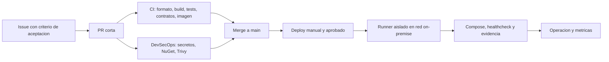

# Plan de plataforma: CI/CD, DevSecOps y agentes

## Reconciliación de estado — 2026-08-12

La [PR #1](https://github.com/JackAcity/api-gestionludopatas/pull/1) que introdujo los workflows fue fusionada el 2026-08-11, antes del cierre formal de Gate 1. Este documento describe una **implementación observada pre-Gate**, no una afirmación de que cada control esté aprobado, operativo o sea suficiente.
Los runs de CI y DevSecOps en `main` han sido exitosos, pero checks verdes no prueban por sí solos protección de mainline, independencia de identidad, autorización de despliegue o integridad de artefacto.

El estado gobernante es el [registro de Gate 1](../architecture/gate-1-closure-checklist.md): `TECHNICAL DESIGN: ACCEPT`, `OVERALL GATE 1: HOLD`.
Este documento no autoriza ejecutar un despliegue ni presentarse como referencia aprobada mientras G1-08 (Gitleaks) y G1-09 (IP/autorización pública) continúen en `HOLD`. Gate 2 reevaluará este baseline y elegirá qué partes, si alguna, satisfacen los controles aprobados.

## Resultado objetivo

El repositorio entrega una API .NET reproducible y trazable: cada cambio pasa por una PR,
genera evidencia de calidad y seguridad, y solo puede llegar a un ambiente mediante un
despliegue manual aprobado que ejecuta desde la red on-premise. No se duplican secretos de
la aplicacion en GitHub: el runner usa el `.env` protegido del host, que solo contiene el
token para que la API recupere sus valores operativos desde Vault.

## Implementación observada en `main` — no controles validados

Los comportamientos que siguen son hipótesis de implementación y deben producir evidencia adversarial en Gate 2 antes de presentarse como controles efectivos.

| Control | Implementacion | Criterio de bloqueo |
|---|---|---|
| Calidad .NET | `.github/workflows/ci.yml` | Restore, formato, build Release con warnings como error y pruebas deben ser verdes. |
| Contrato versionado | CI analiza todos los JSON de Postman y `endpoint`; las pruebas cubren el OpenAPI generado. | Un JSON mal formado o una prueba de contrato rompe la PR. |
| Imagen reproducible | Dockerfile multi-stage, usuario no root y bases .NET fijadas por digest. | La imagen debe construir y conservar el usuario `gestionludopatas`. |
| Dependencias | Auditoria NuGet transitiva con severidad baja como minimo, Dependabot semanal. | Vulnerabilidad conocida reportada por NuGet falla el flujo. |
| Secretos | Gitleaks en PR, `main` y semanal. | Un secreto detectado falla el flujo; se rota, no se "acepta". |
| Imagen | Trivy falla para vulnerabilidades corregibles HIGH/CRITICAL. | No se hace merge hasta actualizar, mitigar con plazo o documentar excepcion aprobada. |
| Automatizaciones | Acciones fijadas a SHA; token por defecto de solo lectura; sin `pull_request_target`. | Una accion no fijada o un permiso innecesario es una desviacion. |
| CD | `deploy.yml` solo se inicia manualmente en `main`, usa environment y un runner dedicado. | Sin runner, `.env` legible o healthcheck configurado, falla antes de tocar Docker. |

## Flujo agil y de cambios

1. Crear issue con criterio de aceptacion y riesgo. Si cambia contrato o arquitectura, crear o actualizar el change OpenSpec antes de codificar.
2. Crear una rama corta (`feat/`, `fix/`, `chore/` o `codex/`) y una PR con la plantilla completa.
3. CI y DevSecOps son evidencia objetiva. El revisor valida el riesgo, reversa y contrato; no solo el diff.
4. Al merge a `main`, la revision queda lista para promoverse. La promocion nunca ocurre desde una rama de feature.
5. Para DEV/QA/PROD, ejecutar **Deploy** desde `main`, seleccionar el ambiente y conservar el enlace de ejecucion en el issue/PR.
6. Si el healthcheck falla, el despliegue es fallido. Revertir a un SHA anterior comprobado y registrar el incidente. La version de base de datos sigue su propio pase DBA; este flujo no ejecuta DDL.

**Definition of Ready:** criterio de aceptacion, propietario, contrato afectado, riesgo,
datos de prueba y reversa conocidos. **Definition of Done:** PR aprobada, controles verdes,
runbook/observabilidad actualizados, evidencia de ambiente cuando corresponde y change
OpenSpec cerrado o con pendiente justificado.

## CD on-premise: configuracion requerida

El deploy no usa secretos de GitHub. Se requiere un runner autoalojado **dedicado por
ambiente**, Linux x64 y con etiquetas:

| Ambiente | Etiquetas obligatorias | Variables de GitHub Environment |
|---|---|---|
| `dev` | `self-hosted`, `linux`, `x64`, `gestionludopatas-dev` | `DEPLOY_ENV_FILE` (ruta absoluta al `.env` remoto), `HEALTHCHECK_URL` |
| `qa` | `self-hosted`, `linux`, `x64`, `gestionludopatas-qa` | Las mismas dos variables, apuntando solo a QA. |
| `prod` | `self-hosted`, `linux`, `x64`, `gestionludopatas-prod` | Las mismas dos variables, apuntando solo a producción. |

El archivo indicado por `DEPLOY_ENV_FILE` queda fuera de Git, propiedad del usuario del
runner y con permisos `0600`. Debe contener solo la configuracion ya descrita en
`api-gestionludopatas/.env.example`; en Fase Vault no incluye `DB_CONNECTION_STRING` ni
`API_KEY`. El runner necesita Docker/Compose y permiso limitado a este repositorio y a su
propio host. No instalarlo en producción hasta tener cuenta de servicio sin acceso
interactivo, parcheo, auditoria de comandos y rotacion de su token.

El workflow solo despliega `main`, serializa por ambiente, valida `docker compose config`
sin imprimir valores y despues exige `/health`. DEV puede habilitarse primero; QA y PROD
deben incorporar aprobadores de Environment antes de instalar sus runners.

## Registro TBD y criterio de cierre

| ID | Pendiente | Por que no se automatiza ahora | Dueño propuesto | Cierre verificable |
|---|---|---|---|---|
| TBD-CD-001 | Runner DEV dedicado | GitHub-hosted no llega a `10.x`; no se asume acceso SSH ni se instala software en el servidor. | Infra/DevOps | Runner con etiqueta DEV, cuenta de servicio, Docker y primer deploy/healthcheck verde. |
| TBD-CD-002 | Environments QA/PROD con aprobadores | Requiere personas y politica de cambio, no una decision de codigo. | Lider tecnico/Operaciones | QA y PROD con aprobadores distintos del autor y proteccion de espera segun politica. |
| TBD-CD-003 | Proteccion de `main` | Exigir PR y checks requiere acordar si existe un segundo revisor; con un solo owner no se puede autoaprobar honestamente. | Equipo | Regla que exige PR, conversaciones resueltas, checks `CI`/`DevSecOps`, no force-push ni borrado. |
| TBD-SEC-001 | GitHub Secret Scanning y Push Protection | Su disponibilidad para repos privados depende del plan/licenciamiento de GitHub. Gitleaks ya cubre CI. | Owner GitHub | Caracteristicas nativas habilitadas y simulacion de secreto bloqueada. |
| TBD-SEC-002 | Code scanning/Dependency Review nativos | Algunas capacidades requieren GitHub Advanced Security en repos privados. | Owner GitHub | Licencia confirmada, CodeQL/Dependency Review verde y como required check si aplica. |
| TBD-SUP-001 | `packages.lock.json` | El proyecto aun no tiene lock files; no se debe activar cache con claves ambiguas ni fabricar locks a mano. | Equipo API | Locks generados y revisados; restore en `--locked-mode` y cache NuGet habilitados. |
| TBD-OBS-001 | SLI/SLO, logs y alertas | Aun falta el destino de logs/metricas y el responsable operativo. | Operaciones | Dashboards para disponibilidad, latencia, 5xx, errores GL, salud SQL/Vault y alertas probadas. |
| TBD-DB-001 | Idempotencia SQL persistente y certificado SQL valido | Requiere pase DBA y certificados fuera del repositorio. | DBA/Arquitectura | Paquete DBA aplicado, pruebas de concurrencia y `TrustServerCertificate=false`. |

## Gobierno de repositorio que debe activarse tras el primer PR verde

- Fijar la politica global de Actions a token de lectura y exigir SHA completa; esta
  entrega ya cumple ambas condiciones.
- Activar auto-delete de ramas tras merge.
- Crear regla de `main`: PR obligatoria, conversaciones resueltas, historial lineal,
  sin force-push/borrado y los checks de CI/DevSecOps. Activar uno o mas aprobadores
  obligatorios cuando exista al menos un revisor distinto al autor.
- Habilitar los GitHub Environments `dev`, `qa`, `prod`; QA/PROD sin secretos de
  aplicacion y con aprobacion humana. No autorizar bypass de administradores para PROD.
- Configurar alertas de Actions fallidas y de Dependabot para el owner operativo.

## Indicadores y cadencia

- Por cada sprint/revision: lead time de PR, frecuencia de despliegue, tasa de cambios
  fallidos y MTTR (DORA); porcentaje de PR con controles verdes; antiguedad de hallazgos
  HIGH/CRITICAL y tiempo de rotacion si hay exposicion.
- Semanal: Dependabot y DevSecOps programado. Quincenal: triage de deuda/TBD. Por release:
  simulacro de reversa y validacion del runbook de ambiente.
- La evidencia se conserva como artifacts de pruebas por 14 dias; el enlace de deploy,
  incidentes y aprobaciones queda en issue/PR.

## Preparacion para SwarmForge (fase posterior)

SwarmForge coordina agentes locales mediante `tmux`, worktrees y archivos de handoff; no
es un servicio CI ni reemplaza las revisiones humanas. Para este backend el punto de
partida recomendado es su flujo `four-pack`: `specifier → coder → refactorer → architect`.
Se sube a `six-pack` solo para cambios con QA end-to-end o impacto mayor.

Precondiciones antes de instalarlo: este CI verde en `main`, reglas de PR activas, un
entorno WSL/Linux con `zsh`, `git`, `tmux`, Babashka y las CLIs de agentes autorizadas; un
clone de trabajo separado (preferible bajo Linux, no dentro del host de producción). Al
instalarlo se versionan solo su configuracion, constitucion y prompts especificos del
proyecto. `.worktrees/` y `.swarmforge/` permanecen locales e ignorados.

Los agentes deben leer `AGENTS.md`, OpenSpec, `SECURITY.md`, este plan y las skills .NET;
no reciben tokens de GitHub, Vault, BD ni acceso de producción. Cada handoff referencia
un commit y cada resultado sigue pasando por CI/DevSecOps. Referencia: [SwarmForge](https://github.com/unclebob/swarm-forge).
